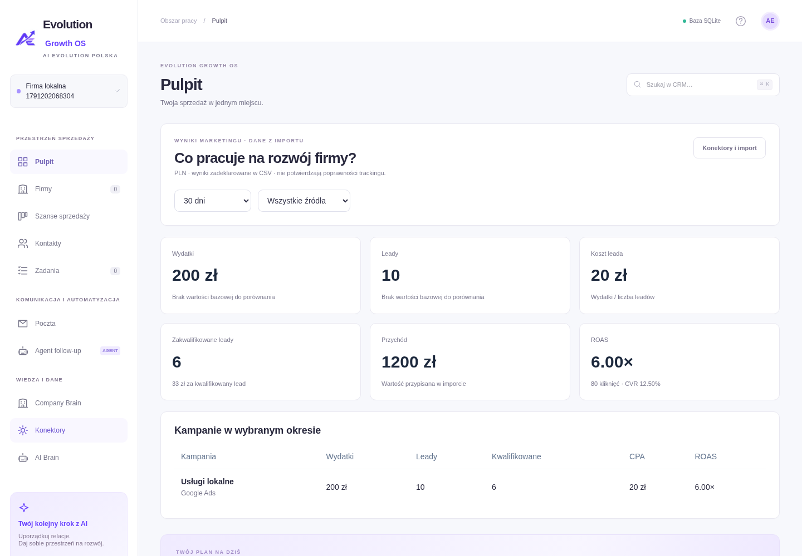
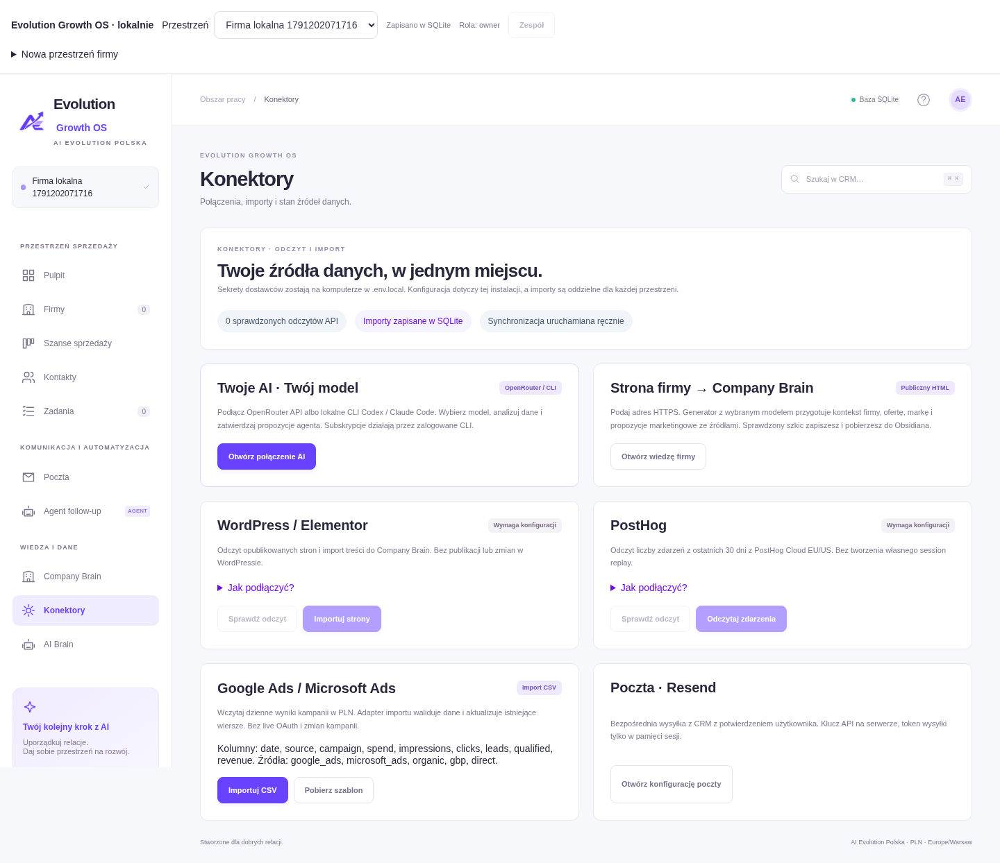
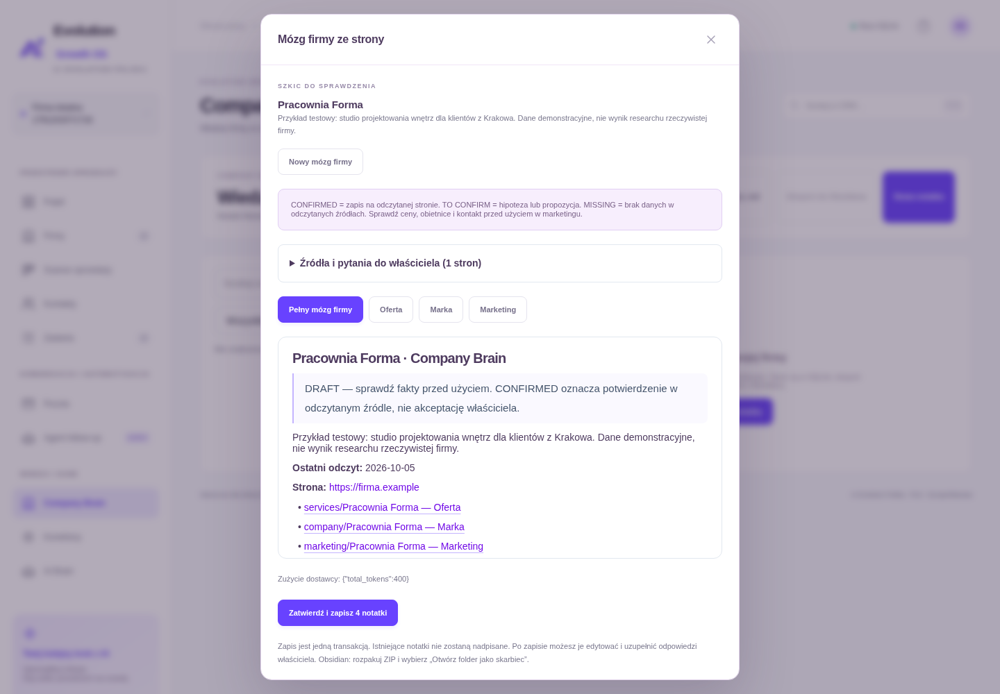
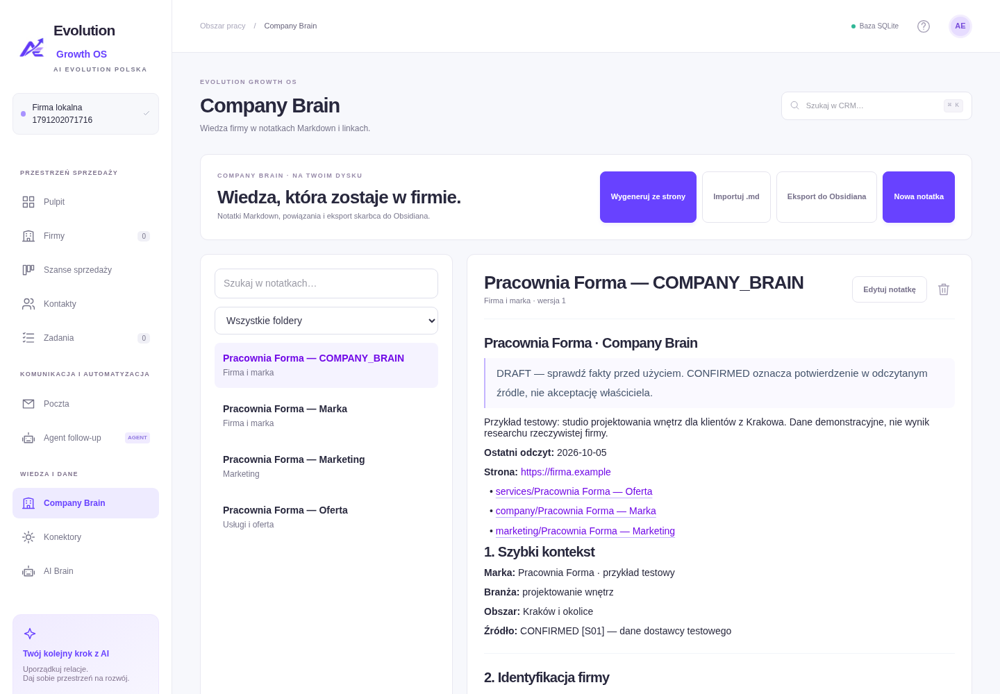
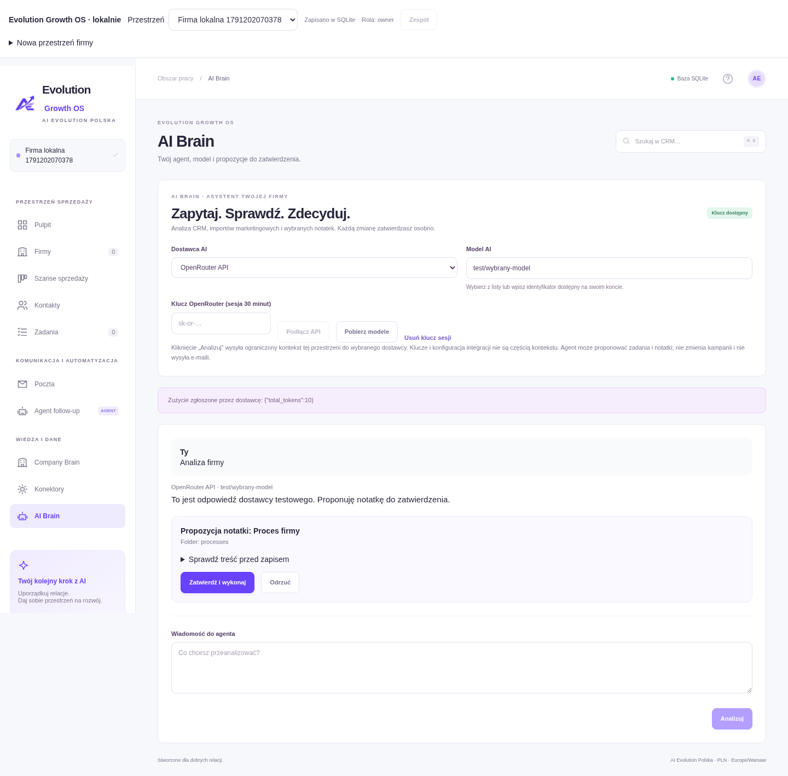

# Evolution Growth OS · AI Evolution Polska

**Lokalny CRM, mózg firmy i agent AI — w jednej aplikacji, po polsku.**

Evolution Growth OS pomaga uporządkować sprzedaż i rozwijać firmę z jej własnym kontekstem. Zapisujesz klientów, kontakty, szanse i zadania. Ze strony internetowej tworzysz Company Brain: ofertę, wiedzę o marce oraz propozycje marketingowe z oznaczeniem źródeł i braków. Podłączasz wybrany model AI, analizujesz dane i zatwierdzasz konkretne działania. Wiedzę możesz zabrać ze sobą do Obsidiana.

Jasny interfejs, PLN, walidacja NIP, polskie daty i strefa Europe/Warsaw. Produkt **AI Evolution Polska**, wersja **0.2.0**. [Opis produktu](docs/PRODUCT.md) · [Architektura lokalna](docs/LOCAL-EDITION.md) · [Plan rozwoju](docs/ROADMAP.md).

## Szybki start na Twoim komputerze

Wymagany **Node.js 24 LTS** i npm. Pobierz repozytorium, otwórz terminal w jego folderze:

```bash
git clone https://github.com/aievolutionpl/CRM-DASHBOARD.git
cd CRM-DASHBOARD
npm ci
npm run dev:localdb
```

Na **tym samym komputerze** otwórz `http://localhost:3000`. Windows: możesz uruchomić `URUCHOM-BAZA.bat`; macOS/Linux: `bash uruchom-baza.sh`. Skrypty instalują zależności i uruchamiają aplikację. Wariant Windows nie był wykonywany w środowisku Linux.

1. Utwórz przestrzeń swojej firmy. Nowy CRM jest pusty.
2. Przejdź przez krótki onboarding.
3. W **AI Brain** podłącz dostawcę i wybierz model.
4. W **Company Brain → Wygeneruj ze strony** przygotuj wiedzę firmy.
5. Dodaj klientów i zaimportuj dane kampanii w **Konektorach**.
6. Sprawdź wyniki na **Pulpicie** i poproś agenta o kolejne kroki.

Serwer uruchamia się tylko na `127.0.0.1`. Zostaw terminal otwarty; `Ctrl+C` zatrzymuje aplikację. Możesz ustawić `CRM_LOCAL_PORT`, gdy port 3000 jest zajęty. `localhost` oznacza komputer przeglądarki: serwer uruchomiony w Codex nie działa na Twoim laptopie. Lokalna edycja nie wymaga Supabase ani konta.

Do codziennego używania bez serwera developerskiego możesz wykonać zoptymalizowany build lokalny:

```bash
npm run build:localdb
npm run start:localdb
```

Oba polecenia ustawiają tryb SQLite. Po zmianie kodu lub publicznych env ponów build. Wspólny katalog `.next` mieści ostatni build: nie uruchamiaj `start:localdb` po buildzie innego trybu.

## Wybierz miejsce przechowywania danych

| Tryb                                    | Uruchomienie                                       | Dane i funkcje                                                                             |
| --------------------------------------- | -------------------------------------------------- | ------------------------------------------------------------------------------------------ |
| **SQLite — zalecany do lokalnej pracy** | `npm run dev:localdb`                              | Plik na komputerze serwera; CRM, Company Brain, generator, konektory, marketing i AI Brain |
| **Przeglądarka**                        | `NEXT_PUBLIC_CRM_MODE=local`, `npm run dev`        | Zachowany CRM z localStorage, pocztą i agentem follow-up                                   |
| **Supabase**                            | Konfiguracja poniżej, `NEXT_PUBLIC_CRM_MODE=cloud` | Konta, przestrzenie, role i wspólny CRM                                                    |

Nowe moduły wiedzy, konektorów i modeli AI działają obecnie w **SQLite**. Supabase obejmuje fundament CRM; migracja pozostałych modułów jest w roadmapie. SQLite jest przeznaczone do lokalnej instalacji, bez kont i logowania. Oddzielne przestrzenie porządkują dane firm; nie stanowią ochrony przed innym użytkownikiem tego samego komputera.

## Company Brain: mózg firmy ze strony

Generator korzysta ze struktury przesłanego [COMPANY BRAIN TEMPLATE](docs/templates/COMPANY_BRAIN_TEMPLATE.md). Szablon jest materiałem odniesienia; aplikacja zachowuje własne zasady zatwierdzania działań.

1. Podłącz AI w **AI Brain**.
2. Otwórz **Company Brain → Wygeneruj ze strony**.
3. Podaj publiczny, docelowy adres HTTPS firmy; wybierz dostawcę i model.
4. Kliknij **Wygeneruj mózg firmy**. Odczytany tekst strony i do 4 podstron tej samej domeny trafi do wybranego modelu.
5. Przeczytaj podgląd, źródła oraz maksymalnie 8 pytań o braki.
6. Wybierz **Zatwierdź i zapisz 4 notatki**. Zapis odbywa się w jednej transakcji.
7. Uzupełnij odpowiedzi właściciela przez **Edytuj notatkę** i pobierz wiedzę do Obsidiana.

| Dokument                  | Zawartość                                                                                                                                           |
| ------------------------- | --------------------------------------------------------------------------------------------------------------------------------------------------- |
| **Firma — COMPANY_BRAIN** | Główny dokument: 34 sekcje, od kontekstu i kontaktu przez ofertę, klientów, markę, SEO i marketing po źródła, aktualność danych oraz historię zmian |
| **Firma — Oferta**        | Usługi, klient, pozycjonowanie i twierdzenia wymagające dowodów                                                                                     |
| **Firma — Marka**         | Ton komunikacji, identyfikacja wizualna i ograniczenia komunikacji                                                                                  |
| **Firma — Marketing**     | Propozycje SEO, treści, reklam, KPI i automatyzacji                                                                                                 |

**CONFIRMED** oznacza informację znalezioną w odczytanym źródle, a nie akceptację właściciela. **TO CONFIRM** to interpretacja, hipoteza lub propozycja. **MISSING** oznacza brak danych w zebranych stronach. Dynamiczne dane, np. ceny i godziny, trzeba ponownie sprawdzić przed publikacją. Model może się pomylić; podgląd i źródła służą weryfikacji.

Generator zbiera publiczny HTML, bez logowania i wykonywania JavaScript. Wybiera podstrony typu oferta, o nas, kontakt, cennik lub FAQ; nie przegląda całej witryny. Nie wyszukuje zewnętrznych opinii, konkurentów ani statystyk SEO. Nieznane sekcje pozostają oznaczone. Nie podawaj linków zawierających tokeny, login lub parametry. Przekierowania są odrzucane: użyj końcowego adresu widocznego w przeglądarce. Limit strony: 2 MB i 20 sekund; do modelu trafia do 14 tys. znaków tekstu z każdej strony.

Odczyt blokuje prywatne adresy sieciowe i przypina zweryfikowany DNS do połączenia TLS. Przy wykrytym proxy HTTPS informuje o ograniczeniu i nie omija proxy. Strony blokujące automatyczny odczyt lub wymagające JavaScript mogą nie dostarczyć treści — wtedy skorzystaj z importu Markdown.

Szkic jest zachowany w SQLite i wraca po ponownym otwarciu generatora. Przed zatwierdzeniem nie trafia do notatek używanych przez agenta. Zapis nie nadpisuje istniejących notatek o tej samej nazwie; konflikt zatrzymuje całą transakcję. Możesz edytować dotychczasową wiedzę albo zmienić jej tytuł przed zapisem kolejnego szkicu. Notatki skrótowe są kopiami sekcji z dnia generowania: po zmianach aktualizuj je razem z dokumentem głównym.

## Wiedza i Obsidian

Company Brain obsługuje foldery, wyszukiwanie, edycję, usuwanie, wersje notatek i linki przychodzące. Markdown ma podgląd nagłówków, list, tabel, pogrubień, kodu i linków HTTPS; surowy HTML nie jest wykonywany.

- `[[Tytuł]]` łączy notatki.
- `[[services/Tytuł]]` wskazuje konkretny folder przy powtarzających się tytułach.
- `[[Tytuł|opis]]` dodaje czytelną nazwę linku.
- **Importuj .md:** do 100 plików naraz, 200 KB na plik, do wybranego folderu. Import plików jest kolejny: przy błędzie wcześniejsze poprawne pliki pozostają zapisane.
- **Eksport do Obsidiana / Pobierz do Obsidiana:** pobiera ZIP z oryginalnym Markdown i folderami.

Rozpakuj ZIP, a w Obsidianie wybierz **Otwórz folder jako skarbiec**. To import i eksport; edycja w Obsidianie nie synchronizuje się automatycznie z aplikacją. Eksport obejmuje notatki bieżącej przestrzeni, bez kampanii i CRM.

## AI Brain: własny dostawca i model

| Dostawca                    | Jak podłączyć                                                                                                            | Rozliczenie                                       |
| --------------------------- | ------------------------------------------------------------------------------------------------------------------------ | ------------------------------------------------- |
| **OpenRouter API**          | Klucz w panelu AI Brain → Podłącz API → Pobierz modele; wybierz lub wpisz identyfikator                                  | Środki i stawka modelu na koncie OpenRouter       |
| **ChatGPT przez Codex CLI** | Zainstaluj Codex CLI, wykonaj `codex login` i zaloguj własne konto; ustaw `LOCAL_AI_CLI_ENABLED=1`, zrestartuj aplikację | Dostęp i limity Twojego planu ChatGPT / konta CLI |
| **Claude Code CLI**         | Zainstaluj Claude Code, zaloguj CLI przez `claude`; ustaw `LOCAL_AI_CLI_ENABLED=1`, zrestartuj aplikację                 | Plan lub rozliczenie skonfigurowane w Claude Code |

Subskrypcja ChatGPT nie jest kluczem OpenRouter ani OpenAI API. Aplikacja korzysta z oficjalnie zalogowanego CLI użytkownika; nie pobiera cookies z przeglądarki. Dostępność konkretnego modelu zależy od konta. Dla Codex wpisz obsługiwany identyfikator; dla Claude możesz użyć np. `sonnet`. Aplikacja wymaga wersji CLI obsługującej flagi opisane w [architekturze lokalnej](docs/LOCAL-EDITION.md).

Klucz wpisany w panelu OpenRouter jest przechowywany w pamięci serwera przez 30 minut. Nie trafia do SQLite ani localStorage. **Usuń klucz sesji** usuwa ten wpis. Alternatywnie ustaw `OPENROUTER_API_KEY` w `.env.local`; klucz z pliku pozostaje aktywny po usunięciu klucza sesyjnego. Status dostępności klucza lub wykrycia CLI nie potwierdza logowania, środków ani dostępu do modelu — sprawdza je rzeczywiste wywołanie.

Agent otrzymuje kontekst wybranej przestrzeni: marketing z 30 dni, do 20 firm, szans i otwartych zadań, do 5 notatek oraz fragmenty 3 ostatnich rozmów. Główny COMPANY_BRAIN jest priorytetem, do 12 tys. znaków; pozostałe notatki są dobierane do pytania, do 2,5 tys. znaków każda. Większa wiedza jest skracana. Dane trafiają do dostawcy po kliknięciu **Analizuj**; klucze integracji nie są częścią kontekstu.

Agent może zaproponować **zadanie** lub **notatkę**. Sprawdź podgląd i wybierz **Zatwierdź i wykonaj** albo **Odrzuć**. Serwer kontroluje przestrzeń, wersję CRM i stan propozycji; ponowienie decyzji nie tworzy duplikatu. Zmiana CRM po analizie wymaga nowej propozycji. Agent nie ma dowolnego SQL, poleceń systemowych, publikacji stron, zmian reklam ani wysyłki e-maili. Poczta ma własne zatwierdzenie.

CLI działa w folderze tymczasowym: Codex z `--ignore-user-config`, `--ignore-rules`, `--ephemeral`, sandbox read-only, wyłączonym shell/unified_exec, MCP i web search; Claude z `--tools ""` i pustą, ścisłą konfiguracją MCP. Narzędzia biznesowe wykonuje aplikacja po zatwierdzeniu. Generator strony jest osobnym przepływem: zbiera publiczną treść i proponuje zestaw wiedzy.

**Koszt:** analiza dopuszcza do 3000 tokenów odpowiedzi, generator do 8000; kontekst wejściowy też podlega rozliczeniu. Zużycie pokazujemy, jeśli dostawca je zwróci. Nie uruchamiamy analiz ani harmonogramów w tle.

## Konektory i pulpit marketingowy

Konektory pokazują brak konfiguracji, udany odczyt, datę sprawdzenia, błąd i wyłączenie w przestrzeni. Odczyt jest ręczny. Po zmianie `.env.local` zrestartuj aplikację; plik dotyczy całej instalacji, a zapisane dane są oddzielne dla firm. „Odczyt API sprawdzony” potwierdza żądanie do API, nie poprawność trackingu.

| Integracja                                   | Konfiguracja                                                                                | Działające operacje                                                                                                 |
| -------------------------------------------- | ------------------------------------------------------------------------------------------- | ------------------------------------------------------------------------------------------------------------------- |
| **WordPress / Elementor**                    | `WP_BASE_URL=https://twoja-strona.pl`; opcjonalnie `WP_USERNAME`, `WP_APPLICATION_PASSWORD` | Sprawdzenie API i import pierwszych 100 opublikowanych stron do folderu `web`; bez publikacji i zmian w Elementorze |
| **PostHog Cloud EU/US**                      | `POSTHOG_HOST`, `POSTHOG_PROJECT_ID`, `POSTHOG_PERSONAL_API_KEY`                            | Liczba zdarzeń według typu z ostatnich 30 dni; ręczny odczyt zapisuje wynik lokalnie                                |
| **Google Ads / Microsoft Ads i inne kanały** | Plik CSV według szablonu z Konektorów                                                       | Import dziennych wyników i aktualizacja tych samych dat, kampanii oraz źródeł; bez live OAuth                       |
| **Resend**                                   | `RESEND_API_KEY`, `CRM_MAIL_FROM`, `CRM_MAIL_ACCESS_TOKEN`                                  | Test odczytu domen i wysyłka zatwierdzonych szkiców                                                                 |
| **OpenRouter / Codex / Claude Code**         | Panel AI Brain lub konfiguracja powyżej                                                     | Wybór modelu, analiza, generator wiedzy i propozycje działań                                                        |

CSV wymaga kolumn `date, source, campaign, spend, impressions, clicks, leads, qualified, revenue`. Daty: `YYYY-MM-DD`; kwoty w PLN; źródła: `google_ads`, `microsoft_ads`, `organic`, `gbp`, `direct`. Obsługuje separator średnik/przecinek, cudzysłowy i polskie znaki. Wartości nie mogą być ujemne, kwalifikowane leady nie mogą przekraczać leadów. Limit: 2 MB / 10 tys. wierszy. Pobierany szablon z zerami jest przykładem do uzupełnienia.

**Pulpit** wylicza wydatki, leady, leady kwalifikowane, CPA, CPQL, przychód, CVR i ROAS z importowanych danych. Możesz wybrać 7/30/90 dni, własne daty i źródło, porównać poprzedni okres oraz zobaczyć kampanie. Brak mianownika daje „—”. Pod marketingiem pozostaje pulpit sprzedaży: firmy, wartości szans i zadania.

## CRM i poczta

Dodawaj firmy z NIP, kontakty, szanse z wartością w PLN i zadania. Tablica szans pozwala przesuwać etap; wykresy i wartości wynikają z aktualnych danych. CRM ma wyszukiwanie, eksporty CSV i kopię JSON.

**Resend:** zweryfikuj domenę nadawcy, skopiuj `.env.example` do `.env.local` i uzupełnij zmienne poczty. W **Ustawieniach** wpisz własny token dostępu na czas sesji i sprawdź połączenie. Klucz Resend jest tylko na serwerze. Przed wysyłką sprawdź odbiorcę, treść i podstawę kontaktu. Wiadomości demonstracyjne do example.com/.org/.net są blokowane. „Przyjęta przez Resend” nie oznacza potwierdzonego doręczenia; brak webhooków i synchronizacji odpowiedzi. Test odczytu domen może wymagać szerszych uprawnień niż klucz tylko do wysyłki.

**Program pocztowy:** otwiera szkic przez `mailto:` w skonfigurowanym Gmailu, Outlooku lub innej aplikacji. Wysyłkę kończysz w tym programie. To nie OAuth ani synchronizacja skrzynki.

**Agent follow-up:** osobny asystent regułowy. Po kliknięciu przygotowuje polskie szkice na podstawie otwartych szans i kontaktów z potwierdzoną podstawą kontaktu. Unika kolejnego oczekującego szkicu dla tej samej osoby. Treść edytujesz i zatwierdzasz w Poczcie. Nie działa w tle i nie korzysta z modelu AI.

## Kopie, przenoszenie i aktualizacja

- **Cała baza SQLite:** w Ustawieniach kliknij **Pobierz całą bazę SQLite**. Spójna kopia zawiera wszystkie przestrzenie, CRM, wiedzę, szkice generatora, kampanie, odczyty i historię agenta. Bez kluczy dostawców.
- **JSON CRM:** obejmuje tylko dane i ustawienia CRM jednej przestrzeni. Umożliwia przeniesienie zachowanego CRM między przeglądarką, SQLite i Supabase.
- **ZIP Obsidian:** obejmuje zapisane notatki jednej przestrzeni.

Domyślny plik: `data/evolution.sqlite`; zmień go przez `CRM_DATABASE_PATH` w `.env.local`. Pliki bazy są wyłączone z Git. Aby odtworzyć kopię, zatrzymaj serwer, zachowaj obecny plik, zastąp go kopią, usuń stare pliki `-wal`/`-shm` **po zatrzymaniu**, a następnie uruchom aplikację. Baza jest na komputerze serwera. Aktualizacja kodu: zachowaj kopię, wykonaj `git pull` i `npm ci`, uruchom ponownie. Schematy lokalne tworzą się przy starcie/użyciu modułów.

Przy konflikcie wersji CRM aplikacja zatrzymuje edycję. Pobierz kopię zmian i wczytaj aktualne dane z bazy. Poczekaj na stan **Zapisano w SQLite / Supabase** przed zamknięciem karty.

## Opcjonalny tryb Supabase

1. Utwórz projekt Supabase i wykonaj [migrację SQL](supabase/migrations/202610050001_growth_foundation.sql) w nowej/testowej bazie. Sprawdź nazwy tabel przed użyciem istniejącego projektu; migracja nie wykonuje się automatycznie.
2. W `.env.local` ustaw:

```dotenv
NEXT_PUBLIC_CRM_MODE=cloud
NEXT_PUBLIC_SUPABASE_URL=https://twoj-projekt.supabase.co
NEXT_PUBLIC_SUPABASE_ANON_KEY=publiczny-klucz-anon-lub-publishable
```

3. W Auth włącz e-mail/hasło oraz potwierdzanie adresów; ustaw Site URL i Redirect URLs aplikacji. Nigdy nie używaj `service_role` jako publicznego klucza.
4. Uruchom `npm run dev`, utwórz i potwierdź konto, zaloguj się, utwórz przestrzeń. Publiczne env ustaw przed produkcyjnym `npm run build`.
5. Właściciel dodaje istniejących użytkowników po UUID z panelu „Moje konto”. Zaproszenia e-mail nie są wdrożone.

Role: owner zarządza członkami; admin i marketer zapisują CRM; viewer ma odczyt. RLS oraz funkcje SQL weryfikują uprawnienia. Zapis snapshotu jest transakcyjny i wersjonowany. Szczegóły: [Faza 1](docs/PHASE-1.md), [architektura](docs/ARCHITECTURE.md), [model danych](docs/DATA-MODEL.md).

Cloud zachowuje szkice i program pocztowy. Wysyłka przez globalny Resend jest wyłączona do wdrożenia konfiguracji per workspace. SQLite i lokalnego CLI nie wystawiaj jako publicznego SaaS. Vercel jest opcją dla trybu Supabase, po konfiguracji env i Auth; nie dla lokalnego pliku SQLite i CLI.

## Gdy coś nie działa

| Objaw                            | Co sprawdzić                                                                 |
| -------------------------------- | ---------------------------------------------------------------------------- |
| localhost nie odpowiada          | Uruchom serwer na komputerze przeglądarki; sprawdź terminal i port           |
| Błąd node:sqlite                 | Zainstaluj Node.js 24 lub nowszy i uruchom `npm ci`                          |
| Brak nowych modułów              | Użyj `npm run dev:localdb`, zamiast trybu przeglądarkowego/cloud             |
| CLI niedostępne                  | Instalacja w PATH, własne logowanie, `LOCAL_AI_CLI_ENABLED=1` i restart      |
| OpenRouter odrzuca analizę       | Klucz, środki, uprawnienia i dokładny identyfikator modelu                   |
| Model nie zwraca poprawnego JSON | Wybierz model obsługujący dłuższe odpowiedzi strukturalne; spróbuj ponownie  |
| Generator nie czyta strony       | Docelowy HTTPS, HTML bez JS, blokady robotów/proxy; alternatywnie import .md |
| Notatka już istnieje             | Edytuj dotychczasową lub zmień jej tytuł; zapis szkicu nie nadpisuje wiedzy  |
| Konektor wymaga konfiguracji     | Uzupełnij serwerowy `.env.local`, zrestartuj, użyj „Sprawdź odczyt”          |
| Poczta nie wysyła                | Domena Resend, nadawca, token, uprawnienia, podstawa kontaktu                |

## Rozwój i weryfikacja

Next.js 16, React 19, TypeScript, Tailwind CSS 4, Zustand, natywne `node:sqlite`. Czytaj [AGENTS.md](AGENTS.md) i dokumentację zainstalowanego Next.js przed zmianami. W Codex korzystaj z istniejącego checkoutu `/workspace/CRM-DASHBOARD`, bez dodatkowego worktree.

```bash
npm test
npm run lint
npx --no-install next typegen
npx --no-install tsc --noEmit --incremental false
npm run build
npm run test:e2e
npm run test:cloud
npm run test:localdb
```

Playwright wymaga Chromium: `npx playwright install chromium` lub `CRM_CHROMIUM_PATH=/ścieżka/do/chromium`. Testy uruchamiają serwery na portach 3000 (CRM), 3001 (cloud UI) i 3002 (SQLite). Nie uruchamiaj kilku instancji Next dev z tym samym `.next/dev` równocześnie. `npm run test:db` dodatkowo wymaga Docker i sprawdza migrację/RLS w jednorazowym Postgres; bootstrap Auth nie jest testem rzeczywistej usługi Supabase Auth.

Testy obejmują walidację, izolację przestrzeni, konflikty, SQLite, kopie, wikilinki, ZIP, import/KPI, adaptery, wybór modelu, zatwierdzanie i generator. Dostawcy API/AI są jawnie mockowani w testach; SQLite i eksporty są rzeczywiste. Generator UI używa dostawcy testowego, a jego atomowy zapis jest sprawdzany osobno na SQLite. Nie wykonano płatnych wywołań AI ani logowania do rzeczywistych kont Supabase, WordPress, PostHog czy Resend w tym środowisku. Live smoke test wymaga własnej konfiguracji użytkownika.

| Katalog                                                   | Odpowiedzialność                                          |
| --------------------------------------------------------- | --------------------------------------------------------- |
| `components/crm`, `components/growth`, `components/local` | Interfejs, tryby, formularze, wiedza, konektory i AI      |
| `lib/local`, `app/api/local`                              | SQLite i lokalne endpointy                                |
| `lib/knowledge`                                           | Notatki, bezpieczny odczyt strony, generator, eksport ZIP |
| `lib/ai`                                                  | Dostawcy, kontekst i zatwierdzane działania               |
| `lib/integrations`                                        | Adaptery, CSV i metryki                                   |
| `lib/supabase`, `supabase/migrations`                     | Auth, wspólny CRM i RLS                                   |
| `tests`                                                   | Testy logiki, bazy i przeglądarki                         |
| `public/assets/brand`                                     | Logo AI Evolution Polska                                  |

## Aktualne screenshoty aplikacji

Zrzuty wykonano w działającej aplikacji. Dane są demonstracyjne. Ekrany AI i generatora pokazują **dostawcę testowego**, nie odpowiedź z płatnego modelu lub research rzeczywistej firmy.

**Pulpit: zaimportowane wyniki kampanii i lokalny zapis SQLite.**



**Konektory: AI, strona firmy, WordPress, PostHog, importy i poczta z rzeczywistymi stanami konfiguracji.**



**Mózg firmy ze strony: podgląd przed zatwierdzeniem — dane dostawcy testowego.**



**Company Brain: zapisany dokument, powiązane notatki, foldery i eksport do Obsidiana.**



**AI Brain: wybrany model, odpowiedź i propozycja do zatwierdzenia — dostawca testowy.**


