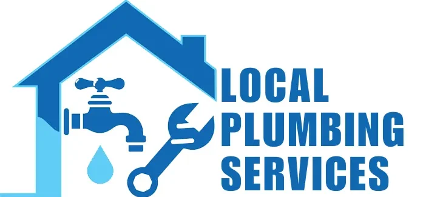
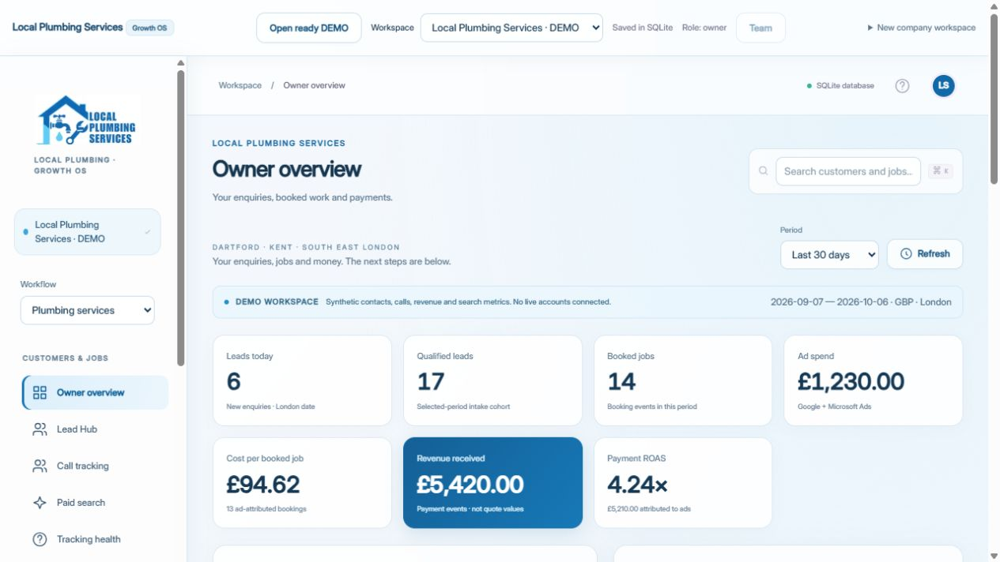

<p align="center"></p>

# Local Plumbing Services · Growth OS

An owner workspace for the UK plumbing business: enquiries, calls, quotes, booked jobs, payment revenue and marketing decisions. Built by extending the existing Evolution Growth OS Lead Hub, Company Brain, connectors, reports, AI assistant and scheduler.



## Open the ready demo

```sh
npm ci
npm run dev:localdb
```

Use Node.js 24 or later. Open http://127.0.0.1:3000/. **Local Plumbing Services · DEMO** loads automatically with 20 synthetic enquiries, call histories, campaign reports, jobs, payments, tracking discrepancies, local SEO observations, a sample SEO audit and the supplied Company Brain. Returning browsers retain their selected workspace; **Open ready DEMO** switches to the populated demo. Loading again preserves edits and does not duplicate records.

The initial 30-day demo includes 6 leads today, 14 bookings, £1,230 spend, £5,420 received payments and 4.24× payment ROAS. Dates move to the first load's London date. These are illustrative values, not the company's real performance. Downloadable CSV/JSON examples are available in the dashboard and `public/demo`.

## What changed

- Local Plumbing Services logo and blue/white branding, local Inter font, glass panels, consistent buttons and simplified owner navigation.
- UK postcode, service, problem, urgency and channel intake; UK phone matching.
- **New Lead → Contacted → Qualified → Quote Sent → Booked → In Progress → Completed → Paid → Lost**, using the existing event ledger.
- Owner KPIs and acquisition funnel, with GBP payment revenue separated from quote/job values.
- Google/Microsoft paid-search imports, CPC/CPA, qualified outcomes and keyword-level revenue context.
- Linked call tracking and CRM-versus-GA4/GTM/Ads conversion observations.
- **SEO Search Audit** for public HTTPS HTML, contact paths and local search phrases, plus separately dated saved Search Console queries.
- Local SEO/GBP observations and a daily evidence-based plumbing briefing using the existing AI and automation flows.

The specialised demo, dashboard, imports and SEO API use the localhost SQLite edition. Existing Google OAuth, Google Ads, GA4, Search Console and Stripe connectors require company account access. Microsoft Ads, keywords/search terms, calls, GBP/local rankings and tracking observations use file imports. The HTML audit does not measure Google rankings or render JavaScript. Browser scheduling requires the app to remain open.

For a production check, run `npm run build:localdb` and `npm run start:localdb`. Existing Supabase Lead Hub is retained; apply the new plumbing pipeline/currency migration before using GBP ledger entries there. The local specialist reports do not have cloud equivalents.

[Audit and ten priorities](docs/LOCAL-PLUMBING-AUDIT.md) · [Setup and data definitions](docs/LOCAL-PLUMBING-SETUP.md) · [Validation](docs/LOCAL-PLUMBING-VALIDATION.md) · [Original Evolution documentation](docs/EVOLUTION-REFERENCE.md)

Validation: `npm test` (72 tests), `npm run lint`, `npx tsc --noEmit`, `npm run build:localdb`, and browser checks of the ready demo, Lead Hub, Company Brain and live HTML audit.
