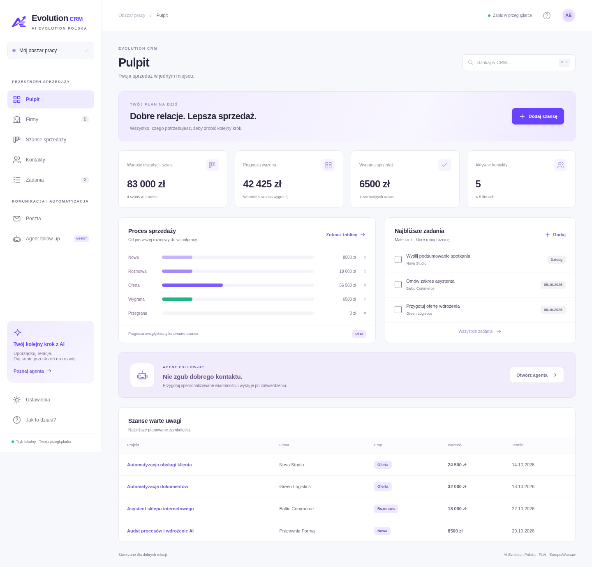
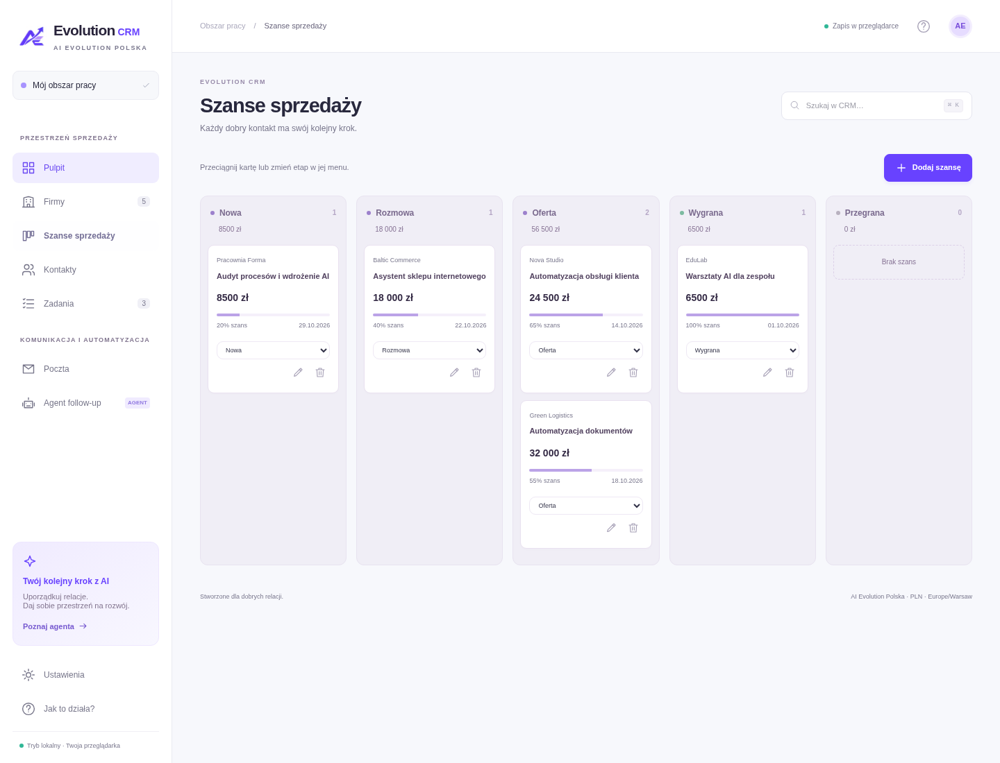
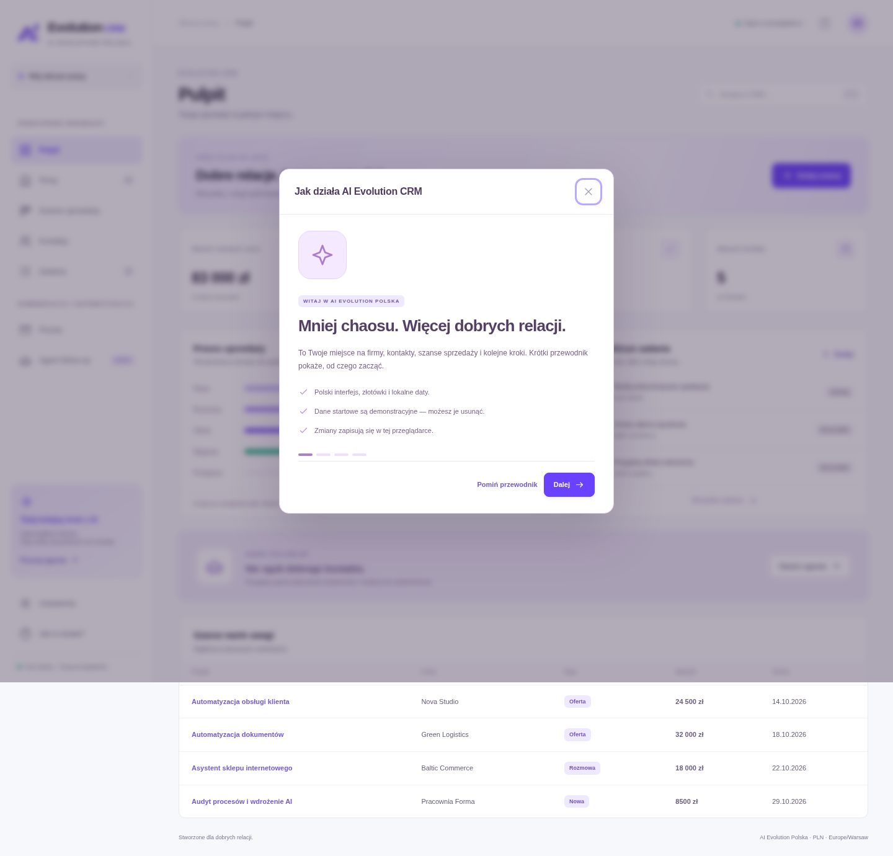
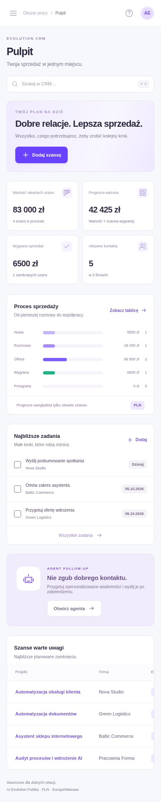
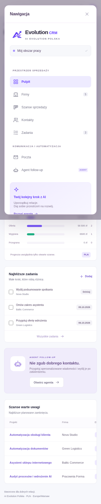

# Evolution CRM · AI Evolution Polska

**Mniej chaosu. Więcej dobrych relacji.**

Evolution CRM pomaga przejść od pierwszego kontaktu do współpracy. Łączy firmy, osoby kontaktowe, szanse sprzedaży, zadania i wiadomości w jednym jasnym obszarze pracy. Zamiast szukać informacji w kilku miejscach, widzisz, z kim rozmawiasz, co oferujesz i jaki jest następny krok.

To produkt od **AI Evolution Polska**, zaprojektowany dla lokalnej pracy: po polsku, z kwotami w złotych, walidacją NIP i datami według Europe/Warsaw. Agent follow-up przygotowuje krótkie szkice wiadomości, a Ty decydujesz, kiedy i do kogo je wysłać.



## Co możesz zrobić

| Moduł               | Działające funkcje                                                                       |
| ------------------- | ---------------------------------------------------------------------------------------- |
| **Pulpit**          | Wartość otwartych szans, prognoza ważona, wygrana sprzedaż, kontakty, najbliższe zadania |
| **Firmy**           | Dodawanie, edycja i usuwanie; NIP, branża, miasto, strona, notatki; filtrowanie i CSV    |
| **Kontakty**        | Osoby przypisane do firm, telefon, e-mail, podstawa kontaktu i tworzenie wiadomości      |
| **Szanse**          | Tablica etapów, przeciąganie kart, menu etapów, wartość PLN, prawdopodobieństwo i termin |
| **Zadania**         | Dodawanie, edycja, usuwanie, oznaczanie ukończenia oraz widoki otwartych i wykonanych    |
| **Poczta**          | Szkice, edycja, podgląd, historia; wysyłka przez Resend lub otwarcie programu pocztowego |
| **Agent follow-up** | Przygotowanie szkiców dla kontaktów z otwartą szansą; pomijanie oczekujących duplikatów  |
| **Ustawienia**      | Podpis, sprawdzenie integracji poczty, kopie JSON, przywracanie i usuwanie danych        |

Pierwsze uruchomienie pokazuje cztery krótkie kroki: organizacja CRM, firmy i szanse, poczta oraz agent. Przewodnik można ponownie otworzyć przez **Jak to działa?**. Wyszukiwanie jest dostępne w nagłówku; skrót **Ctrl+K / ⌘K** ustawia na nim fokus.

<details>
<summary>Tablica szans, onboarding i telefon</summary>






</details>

## Jak przechowywane są dane

CRM jest aplikacją do pracy lokalnej, dla jednego obszaru pracy w przeglądarce. Zustand zapisuje firmy, kontakty, szanse, zadania, wiadomości, podpis i ustawienia agenta w **localStorage**. Odświeżenie strony zachowuje zapisane dane. Przeglądarki, profile i urządzenia mają osobne zbiory danych.

- Pierwszy start zawiera **przykładowe firmy i fikcyjne kontakty** z adresami `example.com`. W Ustawieniach można je usunąć.
- Wyczyszczenie danych przeglądarki usuwa także zapis CRM. Regularnie pobieraj **kopię JSON**; import zastępuje bieżący zestaw po zatwierdzeniu i walidacji.
- Kopia zawiera dane kontaktowe i treści wiadomości. Nie zawiera kluczy API ani tokenu sesji poczty.
- Aplikacja nie ma kont użytkowników, współdzielonej bazy, synchronizacji między urządzeniami ani logowania. Publiczne wdrożenie nie czyni jej wieloosobowym SaaS-em.

## Szybkie uruchomienie na komputerze

Zalecany **Node.js 24 LTS** i npm. Kod aplikacji wymaga Node.js co najmniej 20.9; całość zweryfikowano na Node.js 24.19.0.

```bash
npm ci
npm run dev -- --hostname 127.0.0.1 --port 3000
```

Otwórz **http://localhost:3000 na tym samym komputerze** i pozostaw terminal uruchomiony. `Ctrl+C` zatrzymuje aplikację. Dostęp do rejestru npm jest potrzebny podczas instalacji. Baza danych ani klucz API nie są potrzebne do pracy z CRM i szkicami.

Alternatywnie:

- **Windows:** uruchom `URUCHOM-CRM.bat`.
- **macOS/Linux:** wykonaj `bash uruchom-crm.sh`.

Skrypt Windows jest dołączony, ale nie był uruchamiany w środowisku Linux. W Codex używaj istniejącego checkoutu `/workspace/CRM-DASHBOARD`, bez tworzenia dodatkowego worktree.

**Ważne:** `localhost` w Twojej przeglądarce wskazuje Twój komputer. Nie otwiera aplikacji działającej na zdalnej maszynie Codex. Podgląd z chmury wymaga przekierowania portu udostępnianego przez platformę albo rzeczywistego wdrożenia.

## Podłączenie e-maili

### Resend — wysyłka bezpośrednio z CRM

1. Utwórz konto Resend i zweryfikuj domenę nadawcy.
2. Skopiuj `.env.example` do `.env.local`.
3. Uzupełnij `RESEND_API_KEY`, `CRM_MAIL_FROM` i własny długi losowy `CRM_MAIL_ACCESS_TOKEN`.
4. Uruchom serwer ponownie. W **Ustawieniach** wpisz token dostępu i sprawdź połączenie.
5. W edycji kontaktu potwierdź podstawę wysłania wiadomości. Utwórz szkic i wybierz **Zatwierdź i wyślij**.

```dotenv
NEXT_PUBLIC_SITE_URL=http://localhost:3000
RESEND_API_KEY=
CRM_MAIL_FROM=
CRM_MAIL_ACCESS_TOKEN=
```

Klucz Resend i adres nadawcy są odczytywane tylko na serwerze. Token sesji wpisywany w interfejsie nie jest utrwalany w localStorage. Endpoint wysyłki wymaga tokenu, sprawdza pochodzenie żądania i waliduje wiadomość. Klucz idempotencji opiera się na identyfikatorze szkicu, żeby ograniczyć podwójne wysyłki przy ponowieniu.

**Przyjęta przez Resend** oznacza odpowiedź dostawcy, nie potwierdzone doręczenie. Aplikacja nie odbiera webhooków doręczeń ani odpowiedzi. Test połączenia odczytuje listę domen; klucz z uprawnieniem tylko do wysyłki może nie przejść tego testu. Adresy demonstracyjne `example.com`, `example.org` i `example.net` są blokowane przy bezpośredniej wysyłce.

W środowisku chmurowym potrzebny jest dostęp do **api.resend.com**. Bez konfiguracji API zwraca informację o brakującym połączeniu, a przycisk wysyłki pozostaje wyłączony. Zaznaczenie podstawy kontaktu nie zbiera zgody — użytkownik potwierdza ją poza aplikacją, gdy jest wymagana.

### Gmail / Outlook / inny program pocztowy

Przycisk **Program pocztowy** otwiera szkic przez `mailto:`. Przeglądarka musi mieć skonfigurowaną aplikację obsługującą pocztę. Wysyłkę kończysz w tym programie. CRM zapisuje **Otwartą w programie pocztowym**, nie „wysłaną”. Nie jest to integracja OAuth ani synchronizacja skrzynki odbiorczej.

## Agent — prosto i pod kontrolą

Agent follow-up jest **asystentem regułowym**, a nie podłączonym modelem generatywnym. Po włączeniu i kliknięciu **Przygotuj follow-upy** wybiera kontakty z potwierdzoną podstawą kontaktu oraz otwartą szansą. Łączy nazwę firmy, projekt i podpis w polski szablon wiadomości.

Nie tworzy kolejnego szkicu, jeśli dla danego kontaktu oczekuje już szkic, błąd do wyjaśnienia lub wysyłka. Nie działa w tle ani według harmonogramu. Szkice trafiają do Poczty, gdzie można je przeczytać, zmienić i zatwierdzić. Nie wysyła bez decyzji użytkownika.

## Testy i build

```bash
npm test
npm run lint
npx --no-install next typegen
npx --no-install tsc --noEmit --incremental false
npm run build
```

Testy jednostkowe sprawdzają NIP, lokalizację, CSV, kopie danych, szkice agenta, autoryzację oraz walidację wiadomości. Testy przeglądarkowe Playwright są zapisane w `tests/e2e/`:

```bash
npx playwright install chromium
npm run build
npm run test:e2e
```

Konfiguracja uruchamia serwer produkcyjny lub korzysta z działającego serwera na porcie 3000. Przeglądarka Chromium jest potrzebna tylko do testów. Jeśli używasz zainstalowanego Chromium, ustaw `CRM_CHROMIUM_PATH`; `CRM_TEST_URL` pozwala wskazać już działającą aplikację. Testy nie wysyłają prawdziwych e-maili.

```bash
npm run start -- --hostname 127.0.0.1 --port 3000
```

Nie uruchamiaj dwóch serwerów na tym samym porcie. Po nowym buildzie zrestartuj serwer produkcyjny.

## Technologia i struktura

Next.js 16 App Router, React 19, TypeScript, Tailwind CSS 4, Zustand i natywne dialogi. Nowy interfejs jest responsywny, korzysta z lokalnych assetów i czcionek systemowych, a widoki oraz raporty obliczają wartości z aktualnego stanu. Playwright i Node test runner służą do walidacji.

| Plik / katalog           | Zastosowanie                                                       |
| ------------------------ | ------------------------------------------------------------------ |
| `components/crm/`        | Jasny obszar pracy, moduły, formularze, poczta, agent i onboarding |
| `stores/crm-store.ts`    | Trwały stan lokalny i operacje na danych                           |
| `lib/crm/model.ts`       | Model, dane demonstracyjne i formatowanie dla Polski               |
| `lib/crm/backup.ts`      | Walidacja kopii oraz eksport                                       |
| `lib/crm/mail-server.ts` | Konfiguracja, autoryzacja i wywołania dostawcy poczty              |
| `app/api/mail/`          | Status, sprawdzenie połączenia i wysyłka                           |
| `app/crm.css`            | Jasny motyw, responsywność i stany interfejsu                      |
| `public/assets/brand/`   | Wygenerowane logo i wariant aplikacji                              |
| `tests/`                 | Testy logiki i przepływów przeglądarkowych                         |
| `docs/PRODUCT.md`        | Opis produktu i jego obecnego zakresu                              |

Starsze komponenty w `components/companies/` pozostają w repozytorium jako wcześniejszy interfejs; główna strona korzysta z `components/crm/workspace.tsx`.

## Hosting i adres strony

Projekt można zaimportować do Vercel jako **Next.js** z `npm ci`, `npm run build` i domyślnym katalogiem wyjściowym. Ustaw rzeczywisty adres HTTPS w `NEXT_PUBLIC_SITE_URL` i ponów wdrożenie. Zmienne poczty wprowadź jako sekrety hostingu; nie zapisuj ich w repozytorium.

To nie zastępuje pracy nad logowaniem, wspólną bazą i polityką dostępu, jeśli produkt ma obsługiwać wiele osób. `robots.txt` ogranicza indeksowanie do hosta kanonicznego, ale nie zabezpiecza danych.

## Rozwój

Przed zmianami przeczytaj [AGENTS.md](AGENTS.md) i dokumentację używanej wersji Next.js w `node_modules/next/dist/docs/`. Zachowuj polskie teksty i etykiety dostępności. Nie dodawaj sekretów ani rzeczywistych danych klientów do demonstracji i zrzutów ekranu.
