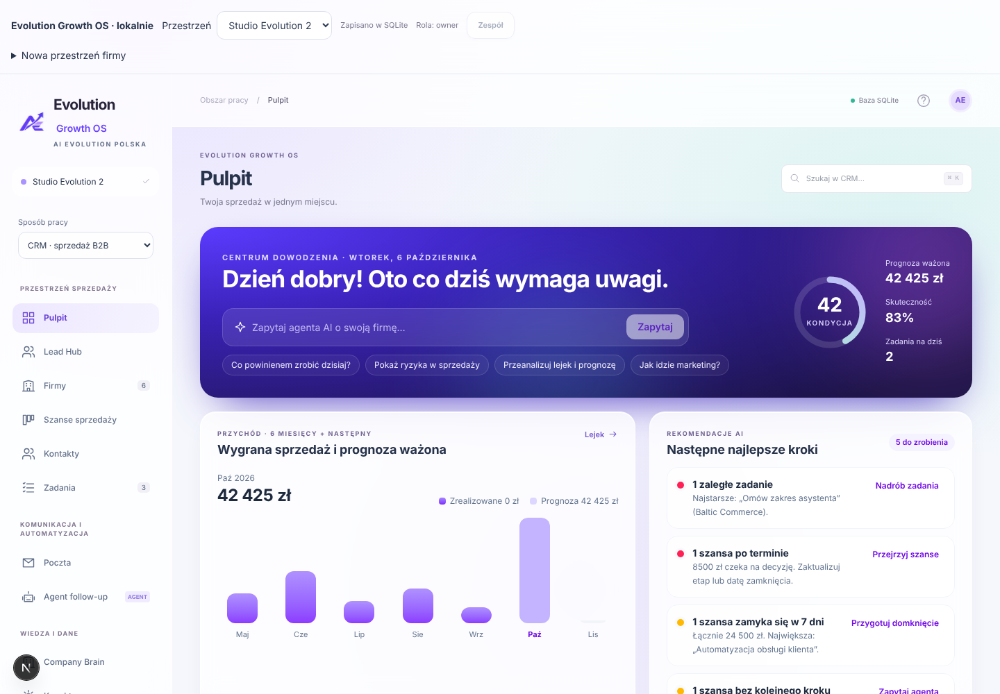
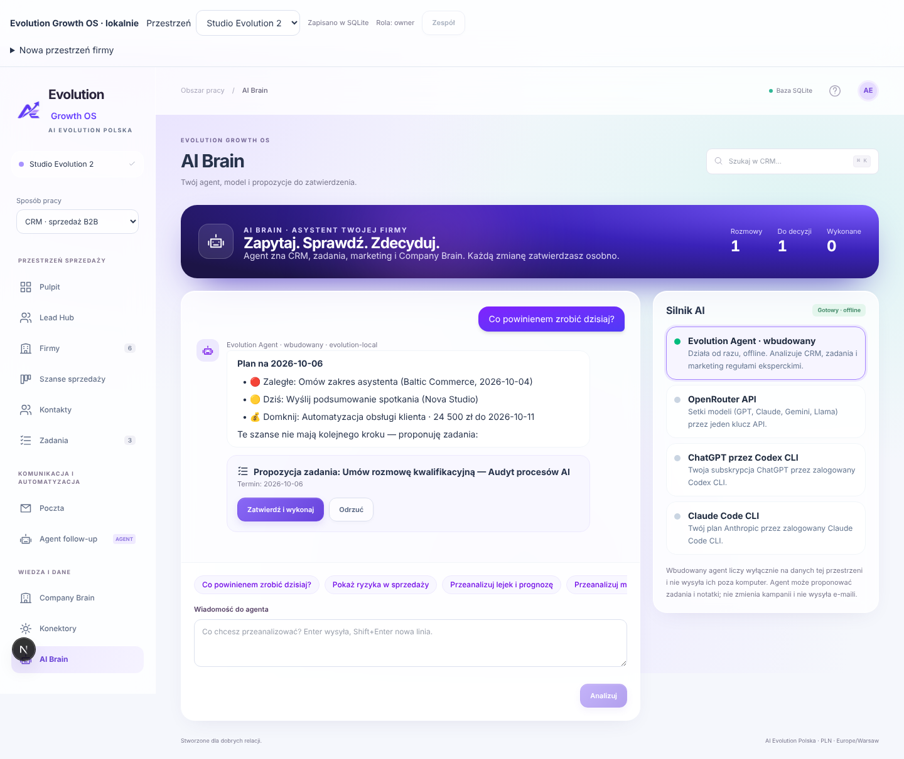
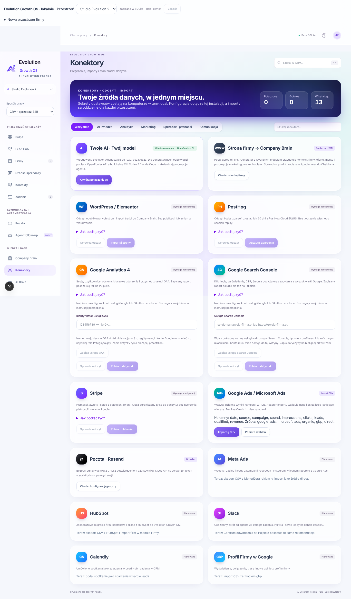

# Evolution Growth OS 0.6 — plan dopracowania produktu

Cel: z działającego MVP zrobić produkt, który od pierwszego ekranu pokazuje wartość — piękny pulpit ze statystykami, agent AI działający bez konfiguracji i konektory na poziomie premium SaaS.

## Plan

| #   | Obszar        | Problem w 0.5                                                                            | Rozwiązanie w 0.6                                                                                                                                                           | Status |
| --- | ------------- | ---------------------------------------------------------------------------------------- | --------------------------------------------------------------------------------------------------------------------------------------------------------------------------- | ------ |
| 1   | Pulpit        | Kafelki z liczbami, brak odpowiedzi „co dalej?”                                          | **Centrum dowodzenia**: hero z kondycją firmy (0–100), KPI, pole „Zapytaj agenta”, wykres przychodu 6 mies. + prognoza, rekomendacje AI z akcjami                           | ✅     |
| 2   | Agent AI      | Działał tylko po podłączeniu OpenRouter/CLI — nowy użytkownik widział wyłączony przycisk | **Evolution Agent (wbudowany)**: działa offline od razu, analizuje CRM, zadania, marketing i Company Brain; proponuje zadania/notatki przez ten sam mechanizm zatwierdzania | ✅     |
| 3   | UI agenta     | Formularz + lista odpowiedzi                                                             | Czat z dymkami, Markdown, szybkie pytania, Enter wysyła, wskaźnik pisania, panel „Silnik AI” z kartami dostawców, liczniki decyzji                                          | ✅     |
| 4   | Konektory     | Lista kart bez hierarchii                                                                | Katalog premium: hero ze statystykami, filtry kategorii, wyszukiwarka, logotypy-monogramy, karty „Planowane” z obejściem na dziś                                            | ✅     |
| 5   | Płatności     | Brak źródła przychodu poza CSV                                                           | **Stripe** (odczyt): przychód netto, zwroty, saldo, wykres dzienny 30 dni                                                                                                   | ✅     |
| 6   | Kolejne kroki | —                                                                                        | Slack digest od agenta, Meta Ads API, migracja HubSpot, Calendly → Lead Hub, agent na danych Lead Hub, harmonogram raportów                                                 | 🔜     |

## Zasady, których się trzymamy

- Agent nie wykonuje zmian sam — każda propozycja wymaga **Zatwierdź i wykonaj**, z kontrolą wersji CRM.
- Wbudowany agent nie wysyła danych poza komputer. Dostawcy zewnętrzni dostają ograniczony kontekst.
- Brak pozorowanych połączeń: konektory „Planowane” mają opis obejścia, a nie fałszywy przycisk „Połącz”.
- Sekrety (np. `STRIPE_SECRET_KEY`) tylko w `.env.local`; zalecany klucz ograniczony `rk_…` z odczytem Balance i Charges.

## Pliki

- `lib/crm/insights.ts` — reguły rekomendacji, kondycja, przychód miesięczny, statystyki lejka.
- `lib/ai/builtin.ts` — wbudowany agent (intencje: plan dnia, ryzyka, lejek, marketing, notatki, firma po nazwie).
- `lib/integrations/stripe.ts` — adapter Stripe i podsumowanie płatności.
- `components/crm/command-center.tsx`, `components/local/agent*.tsx`, `components/local/connector-catalog.tsx` — interfejs.
- `tests/agent.test.cjs` — testy jednostkowe powyższych modułów.

